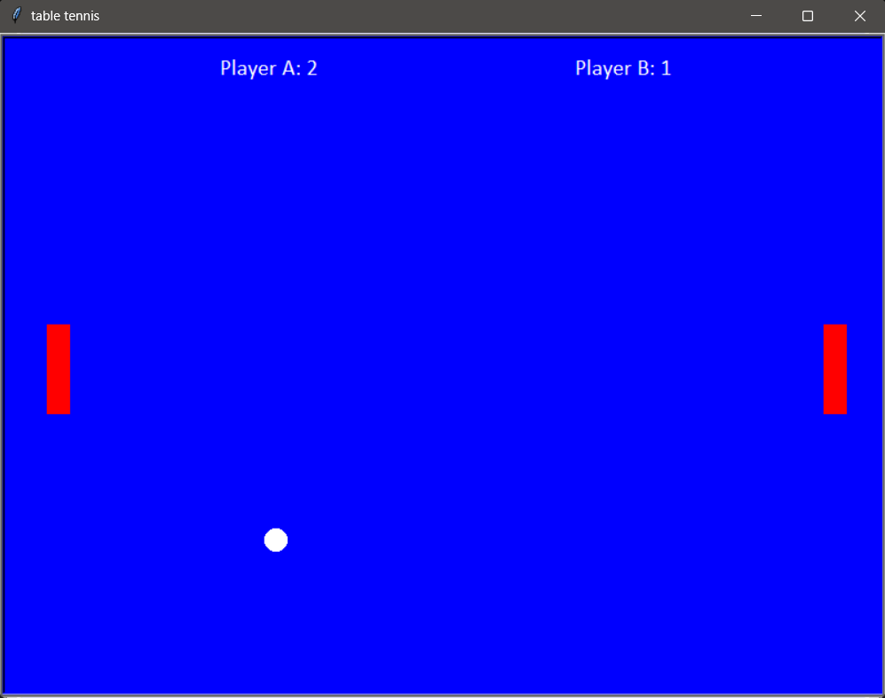

# Table Tennis Game
<b>Summary:</b>

Project displays a table, with a racquet on each side and a moving ball. The left and right racquets are controlled using the w,s and up, down arrow keys respectively

 
<b>How to use code:</b>
 

Download zip and then run the file tabletennis.py

 
<b>How code should run:</b>
 

